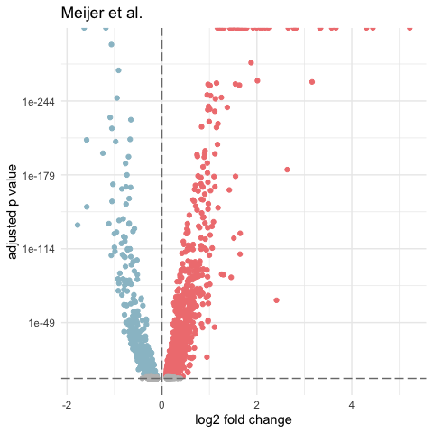

Myelin insulation as a risk factor for axonal degeneration in autoimmune
demyelinating disease. Reanalysis of scRNAseq of myelinating
oligodendrocytes in EAE
================

# OLG reanalysis

This script contains reanalysis of external OLG scRNA-seq data (EAE vs
WT)

-   mouse: Falcao et al 2018, Meijer et al 2022

## Initialization

### Environment preparation

### Document setup

``` r
knitr::opts_chunk$set(message = FALSE)
knitr::opts_chunk$set(warning = FALSE)
knitr::opts_chunk$set(error = FALSE)
```

### Install and attach required packages

``` r
#scRNA-seq analysis
library(Seurat)
library(Signac)
library(SeuratDisk)
library(SingleCellExperiment)
library(dittoSeq)
library(sctransform)
library(scran)
library(scater)
library(scuttle)
library(gprofiler2)
library('org.Mm.eg.db')
library('org.Hs.eg.db')
library(scCustomize)

#DEG analysis
library(DESeq2)

#data wrangling
library(tidyverse)
library(textshape)
library(curl)
library(GEOquery)
library(purrr)
library(PCAtools)


#visualization
library(ggrepel)
library(cowplot)
library(ggVennDiagram)
library(pheatmap)
library(ComplexHeatmap)
library(simplifyEnrichment)
library(viridis)
library(RColorBrewer)
library(circlize)
library(scales)
library(gridtext)
library(ggtext)
library(facefuns)
```

### Define input and output directories

``` r
wd = getwd()

indir = paste0(wd,'/scRNAdata/OL/')
dir.create(indir,recursive = TRUE)

outdir = paste0(wd,'/Output/OL/')
dir.create(outdir,recursive = TRUE)

figdir = paste0(wd,'/figures/OL/')
dir.create(figdir,recursive = TRUE)
```

## Data download

### Download data for Meijer et al. 2022

``` r
gse_meijer = 'GSE193238'
if(!file.exists(paste0(indir,gse_meijer,'/GSE193238_EAE_CtrlPeak_multiomics_GEO.rds'))){
  supp_meijer <- getGEOSuppFiles(gse_meijer,
                               baseDir = indir,
                               makeDirectory = TRUE,
                               filter_regex = '.rds')
}
meijer = readRDS(paste0(indir,gse_meijer,'/GSE193238_EAE_CtrlPeak_multiomics_GEO.rds'))
meijer$condition = meijer$sample %>% as.factor %>% recode(Ctr = 'no EAE',EAE_peak = 'EAE')
#the file compression seems to be corruputed. it's possible you need to download the file by hand and exctract it manually. The correct file size should be 3.2 GB
```

### Download data for Falcao et al. 2018

``` r
gse_falcao = 'GSE113973'
#the geo record contains individual count matrices for each plate 
supp_falcao = paste0(indir,gse_falcao,'/',dir(paste0(indir,gse_falcao)))
if(length(supp_falcao) == 1) {
supp_falcao <- getGEOSuppFiles(gse_falcao,
                               baseDir = indir,
                               makeDirectory = TRUE,
                               filter_regex = 'counts.tab.gz',
                               fetch_files = TRUE) %>% 
                rownames}
falcao_exp = lapply(supp_falcao,function(x) {
  exp = read_tsv(x)
  genes = make.unique(exp$gene)
  mat = as.matrix(exp[-1])
  rownames(mat) = genes
  return = mat  })

#the annotation data is not contained in the GEO record but can only be retrieved from the UCSC cell browser entry of the dataset
# Download annotation
falcao_meta = paste0(outdir,'falcao_annotation.rds')
if(!file.exists(paste0(outdir,'falcao_annotation.rds'))) {
      falcao_meta = curl_download(url = 'https://cells.ucsc.edu/oligo-lineage-ms/Annotation.rds',
                                  destfile = paste0(outdir,'falcao_annotation.rds'))}
falcao_meta = readRDS(paste0(outdir,'falcao_annotation.rds'))

# split annotation 
falcao_meta = split(falcao_meta, falcao_meta$Plate)

#clean up rownames
falcao_meta = lapply(falcao_meta,function(x) {
                     tmp = x
                     rownames(tmp) = gsub('counts_...\\.tab\\.','',rownames(tmp))
                     return = tmp})
#name expression matrices 
names(falcao_exp) = names(falcao_meta)

#subset expression matrices to only include annotated cells
falcao_exp_filt = purrr::imap(falcao_exp,function(x,y){
  x[,rownames(falcao_meta[[y]])]
})

#create seurat objects from annotation and expression matrices 
falcao_seurat = purrr::imap(falcao_exp_filt,function(x,y){
  CreateSeuratObject(counts = x,
                     meta.data = falcao_meta[[y]])
})

#merge all plates into one 
falcao = Merge_Seurat_List(falcao_seurat)
falcao$condition = falcao$Group %>% as.factor %>% recode(Ctrl = 'no EAE',EAE = 'EAE', )
```

## Data analysis

### Falcao et al 2018

#### Subset to only oligodendrocytes

``` r
falcao$MOL <- grepl('^MOL',falcao@meta.data$Renamed_clusternames)
falcao.mol <- falcao %>% subset(MOL)
DefaultAssay(falcao.mol)<-'RNA'
```

#### aggregate counts for pseudo-bulk

``` r
#aggregate counts
falcao.summed<-AggregateExpression(falcao.mol, 
                                   group.by = c('Plate'), 
                                   assays = 'RNA', 
                                   slot = 'counts',
                              
                                   return.seurat = FALSE)

#extract matrix and transpose row and columns
falcao.cts<-falcao.summed$RNA

#generate sample metadata
falcao.coldata<-data_frame(samples = colnames(falcao.cts))
  #from plate 290 to 295, groups info: Ctrl, Ctrl, EAE, EAE,EAE, Ctrl
  falcao.coldata$condition<-c('Ctrl', 'Ctrl', rep('EAE', 3), 'Ctrl')
  #make samples to rownames
  rownames(falcao.coldata) = falcao.coldata$samples
  
#observe assembled count matrix and metadata
  head(falcao.cts)
```

           SS2-16-290 SS2-16-291 SS2-16-292 SS2-16-293 SS2-16-294 SS2-16-295
    Adora1      19856      14258      29987      10457      19095      21180
    Sntg1         114          1          0          0          2          0
    Prim2         638       1667        442        557       1019       1609
    Bai3           14       1166        155        510        426        559
    Cflar         536        686       1214        722       1033        753
    Gpr39           0          0          0          0          0          0

``` r
  head(falcao.coldata)
```

    # A tibble: 6 × 2
      samples    condition
      <chr>      <chr>    
    1 SS2-16-290 Ctrl     
    2 SS2-16-291 Ctrl     
    3 SS2-16-292 EAE      
    4 SS2-16-293 EAE      
    5 SS2-16-294 EAE      
    6 SS2-16-295 Ctrl     

#### QC using PCA

``` r
falcao.pca.raw<-prcomp(t(falcao.cts)) #run PCA, scale=T

#extract calculated variances to assist visualization
  #get percentage of variant explained by each pc
falcao.percentVAR<- round(100*falcao.pca.raw$sdev^2/sum(falcao.pca.raw$sdev^2), 1)

  #get sd ratios of PC2/PC1 to adjust plot center
falcao.sd.ratio<-sqrt(falcao.percentVAR[2]/falcao.percentVAR[2])

#organize PC1, PC2 coordinate, and group information into one data frame

falcao.dataGG<-data.frame(PC1 = falcao.pca.raw$x[,1], PC2 = falcao.pca.raw$x[,2],
                          condition=falcao.coldata$condition)

#plot sample distances
(falcao.pca.plt<-ggplot(falcao.dataGG, aes(PC1, PC2, label= rownames(falcao.dataGG)))+
    geom_point(aes(colour=condition))+
    ggtitle('Falcao et al 2018, MOL pseudobulk profiles PCA')+
    xlab(paste0('PC1, VarExp: ', falcao.percentVAR[1], '%'))+ #xaxis title
    ylab(paste0('PC2, VarExp: ', falcao.percentVAR[2], '%'))+ #yaxis title
    theme(plot.title = element_text(hjust = 0.5))+ #put title in the middle
    coord_fixed(ratio = falcao.sd.ratio)+ #coordinate ratio based on sd ratio
    scale_color_manual(values = c('darkorange','dodgerblue3'))+
    geom_text_repel(aes(color=factor(condition)), fontface=2)
  )
```


-   observed a clear outlier: SS2-16-292

#### QC using sample embedding

``` r
#process & embed falcao data
falcao.mol = 
  falcao.mol %>% 
    NormalizeData(object = .,normalization.method = "LogNormalize",scale.factor = 1e4) %>%
    FindVariableFeatures() %>% 
    ScaleData(features = rownames(.)) %>% 
    RunPCA() %>% 
    RunUMAP(dims = 1:10)
```

``` r
DimPlot(falcao.mol,group.by = 'Plate')
```


-   in UMAP representation of single MOL cells all cells of plate
    SS2-16-292 seem to cluster separately from the rest as well

``` r
#remove sample SS2-16-292 for Seurat data 
falcao.mol = 
  subset(falcao.mol, Plate != 'SS2-16-292')
  falcao.mol %>% 
    NormalizeData(object = .,normalization.method = "LogNormalize",scale.factor = 1e4) %>%
    FindVariableFeatures() %>% 
    ScaleData(features = rownames(.)) %>% 
    RunPCA() %>% 
    RunUMAP(dims = 1:10)
```

    An object of class Seurat 
    24490 features across 940 samples within 1 assay 
    Active assay: RNA (24490 features, 2000 variable features)
     2 dimensional reductions calculated: pca, umap

#### Pseudo-bulk DEG using DESeq2

``` r
#remove sample SS2-16-292 for pseudobulk
falcao.mol <- falcao.mol %>% subset(Plate != 'SS2-16-292')

#clean outlier from pseudobulk
falcao.cts<-falcao.cts[,colnames(falcao.cts) != 'SS2-16-292']
falcao.coldata<-falcao.coldata[row.names(falcao.coldata) != 'SS2-16-292', ,drop=FALSE]

#Create DESeq2 object
  falcao.dds<-DESeqDataSetFromMatrix(countData = falcao.cts, colData = falcao.coldata,
                                       design = ~ condition)

#filter genes that has lower than 10 reads
falcao.dds<-falcao.dds[rowSums(counts(falcao.dds)) >=10, ]

############to do, PCA or MDS control

#run DESeq
falcao.dds<-DESeq(falcao.dds)
resultsNames(falcao.dds)
```

    [1] "Intercept"             "condition_EAE_vs_Ctrl"

``` r
#extract results
falcao.res<-results(falcao.dds, name = "condition_EAE_vs_Ctrl")
falcao.res
```

    log2 fold change (MLE): condition EAE vs Ctrl 
    Wald test p-value: condition EAE vs Ctrl 
    DataFrame with 16536 rows and 6 columns
             baseMean log2FoldChange     lfcSE       stat    pvalue      padj
            <numeric>      <numeric> <numeric>  <numeric> <numeric> <numeric>
    Adora1 16326.5212     -0.0326299  0.176061 -0.1853336 0.8529674  0.967251
    Sntg1     20.9765     -5.2517296  3.365019 -1.5606834 0.1185985  0.449492
    Prim2   1050.0012     -0.4554811  0.493946 -0.9221275 0.3564621  0.737714
    Bai3     547.9571      0.0897899  1.210080  0.0742016 0.9408500  0.989433
    Cflar    751.0066      0.7403866  0.351701  2.1051611 0.0352773  0.224831
    ...           ...            ...       ...        ...       ...       ...
    Prdx3  10342.0878     -0.3378690  0.240540  -1.404628  0.160132  0.519552
    Sfxn4   1257.1419     -0.2014504  0.341870  -0.589261  0.555686  0.869381
    Gm7102    52.8292      0.4894105  0.986932   0.495891  0.619971  0.895623
    Csf2ra   681.4682     -0.0613268  0.339739  -0.180511  0.856751  0.968161
    eGFP   13900.1342      2.6063330  3.315592   0.786084        NA        NA

#### extract significant result, observe DEG balance using volcano plot

``` r
colnames(falcao.res)<-paste0('Falcao_EAEvsCtrl_',colnames(falcao.res))
falcao.res<-as.data.frame(na.omit(falcao.res))

volcano<-function(x, plt_title){
  fc_position<-grep('log2FoldChange', colnames(x))
  adjp_position<-grep('padj', colnames(x))
  
  x$diffexpressed<-'NO'
  x$diffexpressed[x[,fc_position] > 0 & x[,adjp_position] < 0.05] <- 'UP'
  x$diffexpressed[x[,fc_position] < 0 & x[,adjp_position] < 0.05] <- 'DOWN'
  
  x$deg_label<-NA
  x$deg_label[x$diffexpressed != 'NO'] <- rownames(x)[x$diffexpressed != 'NO']
  
  ggplot(data = x, aes(x = x[,fc_position], y = -log10(x[,adjp_position]), col = diffexpressed, 
                       #label = deg_label
                       ))+
    geom_point()+
    theme_minimal()+
    #geom_text_repel(max.overlaps = 20)+
    scale_color_manual(values = c('lightblue3','grey','lightcoral'))+
    geom_vline(xintercept = 0, col = 'grey48', linetype = 'longdash')+
    geom_hline(yintercept = -log10(0.05), col='grey48', linetype = 'longdash')+
    ggtitle(plt_title)
}

#plot a volcano for falcao pseudobulk result
volcano(x = falcao.res, plt_title = 'Falcao EAEvsCtrl pseudobulk volcano plot')
```


### Meijer et al 2020

#### Subset to Oligodendrocytes

``` r
#only keep MOLs
unique(meijer@meta.data$Final_celltypes)
```

     [1] "MOL56_EAE" "MOL56_Ctr" "MOL12_EAE" "Astro"     "MiGl"      "MOL3_EAE" 
     [7] "MOL_Ctr"   "MOL2_Ctr"  "OPC_Ctr"   "OPC_EAE"   "NFOL"      "COP"      

``` r
meijer <- subset(meijer, 
                 subset = Final_celltypes %in% unique(grep('MOL',
                                                           meijer$Final_celltypes,
                                                           value = TRUE)))
#visualize subset data
DimPlot(meijer, group.by = 'Final_celltypes', label = TRUE)
```


#### repeat basic data processing

``` r
#generate pure RNA profile obj
meijer.re<-CreateSeuratObject(counts = meijer@assays$RNA@counts, meta.data = meijer@meta.data, project = 'meijer.re')

#renormalize, rescale, pca, umap 
meijer.re = 
  meijer.re %>% 
    NormalizeData(object = .,normalization.method = "LogNormalize",scale.factor = 1e4) %>%
    FindVariableFeatures() %>% 
    ScaleData(features = rownames(.)) %>% 
    RunPCA() %>% 
    RunUMAP(dims = 1:15)

DimPlot(meijer.re, group.by = 'Final_celltypes')
```


#### DEG using wilcox test

Meijer data DGE analysis and result visualization because of the lack of
replicates, DGE analysis is run using wilcox test

``` r
Idents(meijer.re)<- 'sample'

meijer.res<-FindMarkers(meijer.re, ident.1 = 'EAE_peak', ident.2 = 'Ctr', min.pct = 0.1, logfc.threshold = 0.1)

head(meijer.res)
```

          p_val avg_log2FC pct.1 pct.2 p_val_adj
    Stat1     0   2.821664 0.900 0.076         0
    B2m       0   5.221057 0.990 0.140         0
    Zbp1      0   1.306073 0.468 0.000         0
    Gbp7      0   2.180216 0.710 0.001         0
    Gbp3      0   1.999629 0.619 0.000         0
    Oasl2     0   1.427295 0.493 0.000         0

``` r
colnames(meijer.res)[c(2,5)]<-c('log2FoldChange','padj')
colnames(meijer.res)<-paste0('meijer_EAEvsCtrl_', colnames(meijer.res))

#plot a volcano for wheeler pseudobulk result
volcano(x = meijer.res, plt_title = 'Meijer EAEvsCtrl DGE volcano plot')
```


``` r
###still some batch effects after bulk normlization, but looks ok
```

\##Enrichment analysis - run ORA analysis for GO:BP - for up and down
regulated genes, respectively

``` r
#ORA GOBP enrichment for mouse data

mouse.marker<-list(falcao.res, meijer.res)
#merge significant result into one matrix, use adjP 0.05 as cutoff
mouse.sig.up<-lapply(mouse.marker, function(x){
  pvalue<-grep('padj',colnames(x))
  fc<-grep('log2FoldChange', colnames(x))
  return(subset(x, subset = x[,pvalue] < 0.05 & x[, fc] > 0))
})

mouse.sig.down<-lapply(mouse.marker, function(x){
  pvalue<-grep('padj',colnames(x))
  fc<-grep('log2FoldChange', colnames(x))
  return(subset(x, subset = x[,pvalue] < 0.05 & x[, fc] < 0))
})

mouse.sig<-c(mouse.sig.up, mouse.sig.down)

names(mouse.sig)<-c('falcao_up','meijer_up','falcao_down','meijer_down')

#loop analysis for all four comparisons and store gprofiler2 result
mouse.ora<-vector(mode = 'list', length = 4)
for (i in 1:4){
  #gprofiler2 enrichment
  gostres_loop<-gost(query = rownames(mouse.sig[[i]]),
                     organism = 'mmusculus', ordered_query = FALSE, multi_query = FALSE,
                     significant = TRUE, exclude_iea = TRUE, evcodes = TRUE,
                     measure_underrepresentation = FALSE,
                     user_threshold = 0.05, correction_method = 'g_SCS',
                     domain_scope = 'annotated', custom_bg = NULL,
                     numeric_ns = '', sources = c('GO:BP'), as_short_link = FALSE)
  
  #export original result table
  mouse.ora[[i]]<-gostres_loop$result
  write.csv(gostres_loop$result[, c(1:13, 16)],
            file = paste0(outdir, 'gprofiler_GOBP_', names(mouse.sig)[i],'.csv'))
  
  #prepare GEM table for cytoscape visualization
  gem<-gostres_loop$result[,c('term_id','term_name','p_value','intersection')]
  colnames(gem)<-c('GO.ID','Description','p.val','Genes')
  gem$FDR<-gem$p.val
  gem$Phenotype = paste0('+', i)
  gem<-gem[,c('GO.ID','Description','p.val','FDR','Phenotype','Genes')]
  
  write.table(gem,
            file = paste0(outdir, 'gprofiler_GOBP_GEM_', names(mouse.sig)[i],'.txt'),
            sep = '\t', quote = FALSE, row.names = FALSE)
}
```

## Figures

### volcano plot

``` r
volcano_falcao = volcano(x = falcao.res, plt_title = 'Falcao et al.')
ggsave(paste0(figdir,'volcano_falcao.svg'),volcano_falcao,dpi = 600,width = 5,height = 5,units = 'cm')
volcano_falcao
```


``` r
volcano_meijer = volcano(x = meijer.res, plt_title = 'Meijer et al.')
ggsave(paste0(figdir,'volcano_meijer.svg'),volcano_meijer,dpi = 600,width = 5,height = 5,units = 'cm')

volcano_meijer
```



### GO aggreated heatmap using simplifyEnrichment

``` r
#note: the package only serves for visualizing GO database enriched results
#re-read in all go results
dir<-list.files(path = outdir, pattern = '.csv')

en.results = lapply(paste0(outdir,dir), function(x){
  tmp = read.csv(x, stringsAsFactors = FALSE) 
  tmp2 = tmp[, c('p_value','term_id','term_name')] %>%
    dplyr::mutate(.,sig_level = -log10(p_value)) %>%
    dplyr::rename(., p.adjust = p_value) 
  return(tmp2)
})
```

``` r
#upregulated gene enriched GO BP terms
  #organize in a list with required column names
mouse.up.go<-list(en.results[[2]], en.results[[4]])
names(mouse.up.go)<-c('Falcao','Meijer')

mouse.down.go<-list(en.results[[1]], en.results[[3]])
names(mouse.down.go)<-c('Falcao','Meijer')

#visualization script met error, potentially due to bug
#tried install Macports and ghostscript to handle pdf file exportation
#transfer this part to ubuntu to operate the following code 
plot_go_up = simplifyGOFromMultipleLists(mouse.up.go, 
                            padj_cutoff = 0.05, 
                            ont = 'BP',
                            exclude_words = c('process','biological','responses','regulation'),
                            db = 'org.Mm.eg.db',
                           #change gradient color
                           heatmap_param = list(col = c('steelblue4', 'white', 'orange3'),
                                                breaks = c(1, 0.05, 0.0005)))
```

    Use column 'term_id' as `go_id_column`.
    Use column 'p.adjust' as `padj_column`.
    1015/1015 GO IDs left for clustering.
    Cluster 1015 terms by 'binary_cut'... 41 clusters, used 1.181449 secs.


``` r
plot_go_down = simplifyGOFromMultipleLists(mouse.down.go, 
                            padj_cutoff = 0.05, 
                            ont = 'BP',
                            exclude_words = c('process','biological','responses','regulation'),
                            db = 'org.Mm.eg.db',
                            #change gradient color
                            heatmap_param = list(col = c('steelblue4', 'white', 'orange3'),
                            breaks = c(1, 0.05, 0.0005)))
```

    Use column 'term_id' as `go_id_column`.
    Use column 'p.adjust' as `padj_column`.
    263/263 GO IDs left for clustering.
    Cluster 263 terms by 'binary_cut'... 16 clusters, used 0.03488302 secs.


### VlnPlots

#### Setup

##### Gene lists

``` r
schirmer_genes = list(
  mhc_i = c('B2m','H2-K1','H2-D1'),
  oligodendrocyte_differentiation = c('Bcas1','Opalin','Sgms1','Sema6a'),
  cell_stress = c('Atf4','Faim2','Junb'),
  iron_accumulation = c('Ftl1','Fth1')
)
names(schirmer_genes) = c('MHC I','Oligodendrocyte differentiation and Cell-cell interaction','Cell stress','Iron accumulation')  
names(schirmer_genes) = purrr::imap(schirmer_genes, function(x,y){paste0(length(x),'_',y)})
```

##### Plot configuration

``` r
VlnPlotTheme = theme(panel.background = element_blank(),
                     axis.line.x = element_line(),
                     text=element_text(size=8),
                     axis.text = element_text(size=8,color = 'black'))

#set graphical plot paramters 
cols = c('#D4D4D4','plum2')
#colsCas = c('noEAE' = "#D4D4D4", 'EAE' = 'plum2')
colsDots = c('black','#008000')
jWidth = 0.3
dWidth = 0.6
pSize = 0.2
pAlpha = 0.3 
colsCas = c('noEAE' = "#D4D4D4", 'EAE' = 'plum2')
```

``` r
falcao = falcao.mol
meijer = meijer.re
```

#### plot genes dysregulated in human MOL (Schirmer et al)

``` r
genes_exp = lapply(schirmer_genes,function(x) get_exp(genes = x))

plots = purrr::imap(genes_exp, function(x,y) {
  name = strsplit(y,'_')[[1]][2]
  plot_exp(x,name)}) 

#add legend to last plot
plots[[4]]  = plots[[4]] + theme(legend.position = 'right',
                                 legend.title = element_blank())
#increase widths parameter to accomodate  legend
names(plots)[4] = paste0('3',gsub('\\d','',names(plots)[4]))
plots
```

    $`3_MHC I`


    $`4_Oligodendrocyte differentiation and Cell-cell interaction`


    $`3_Cell stress`


    $`3_Iron accumulation`


#### Plot Slc16a1 expression

``` r
genes_exp = get_exp(genes = 'Slc16a1')

plots = plot_exp(genes_exp, 'Slc16a1') + theme(axis.text.x = element_blank(),
                                               axis.ticks.x = element_blank(),
                                               legend.position = 'right',
                                               legend.title = element_blank())
plots
```


## sessionInfo

``` r
sessionInfo()
```

    R version 4.1.2 (2021-11-01)
    Platform: aarch64-apple-darwin20 (64-bit)
    Running under: macOS Monterey 12.2.1

    Matrix products: default
    BLAS:   /Library/Frameworks/R.framework/Versions/4.1-arm64/Resources/lib/libRblas.0.dylib
    LAPACK: /Library/Frameworks/R.framework/Versions/4.1-arm64/Resources/lib/libRlapack.dylib

    locale:
    [1] en_US.UTF-8/en_US.UTF-8/en_US.UTF-8/C/en_US.UTF-8/en_US.UTF-8

    attached base packages:
    [1] grid      stats4    stats     graphics  grDevices datasets  utils    
    [8] methods   base     

    other attached packages:
     [1] facefuns_0.0.0.9000         ggtext_0.1.1               
     [3] gridtext_0.1.4              scales_1.2.0               
     [5] circlize_0.4.15             RColorBrewer_1.1-3         
     [7] viridis_0.6.2               viridisLite_0.4.0          
     [9] simplifyEnrichment_1.4.0    ComplexHeatmap_2.10.0      
    [11] pheatmap_1.0.12             ggVennDiagram_1.2.1        
    [13] cowplot_1.1.1               PCAtools_2.6.0             
    [15] ggrepel_0.9.1               GEOquery_2.62.2            
    [17] curl_5.0.0                  textshape_1.7.3            
    [19] forcats_0.5.1               stringr_1.4.0              
    [21] dplyr_1.0.9                 purrr_0.3.4                
    [23] readr_2.1.2                 tidyr_1.2.0                
    [25] tibble_3.1.7                tidyverse_1.3.1            
    [27] DESeq2_1.34.0               scCustomize_0.7.0          
    [29] org.Hs.eg.db_3.14.0         org.Mm.eg.db_3.14.0        
    [31] AnnotationDbi_1.56.2        gprofiler2_0.2.1           
    [33] scater_1.22.0               scran_1.22.1               
    [35] scuttle_1.4.0               sctransform_0.3.3          
    [37] dittoSeq_1.6.0              ggplot2_3.3.6              
    [39] SingleCellExperiment_1.16.0 SummarizedExperiment_1.24.0
    [41] Biobase_2.54.0              GenomicRanges_1.46.1       
    [43] GenomeInfoDb_1.30.1         IRanges_2.28.0             
    [45] S4Vectors_0.32.4            BiocGenerics_0.40.0        
    [47] MatrixGenerics_1.6.0        matrixStats_0.62.0         
    [49] SeuratDisk_0.0.0.9020       Signac_1.7.0               
    [51] sp_1.5-0                    SeuratObject_4.1.0         
    [53] Seurat_4.1.1               

    loaded via a namespace (and not attached):
      [1] rsvd_1.0.5                svglite_2.1.0            
      [3] ica_1.0-3                 RcppRoll_0.3.0           
      [5] Rsamtools_2.10.0          foreach_1.5.2            
      [7] lmtest_0.9-40             crayon_1.5.1             
      [9] spatstat.core_2.4-4       MASS_7.3-57              
     [11] nlme_3.1-158              backports_1.4.1          
     [13] reprex_2.0.1              GOSemSim_2.22.0          
     [15] rlang_1.0.4               XVector_0.34.0           
     [17] ROCR_1.0-11               readxl_1.4.0             
     [19] irlba_2.3.5               limma_3.50.3             
     [21] BiocParallel_1.28.3       rjson_0.2.21             
     [23] bit64_4.0.5               glue_1.6.2               
     [25] parallel_4.1.2            vipor_0.4.5              
     [27] spatstat.sparse_2.1-1     spatstat.geom_2.4-0      
     [29] haven_2.5.0               tidyselect_1.1.2         
     [31] fitdistrplus_1.1-8        XML_3.99-0.10            
     [33] zoo_1.8-10                ggpubr_0.4.0             
     [35] xtable_1.8-4              magrittr_2.0.3           
     [37] evaluate_0.15             cli_3.3.0                
     [39] zlibbioc_1.40.0           RVenn_1.1.0              
     [41] rstudioapi_0.13           miniUI_0.1.1.1           
     [43] rpart_4.1.16              fastmatch_1.1-3          
     [45] shiny_1.7.1               BiocSingular_1.10.0      
     [47] xfun_0.31                 tm_0.7-10                
     [49] clue_0.3-61               cluster_2.1.3            
     [51] KEGGREST_1.34.0           listenv_0.8.0            
     [53] Biostrings_2.62.0         png_0.1-7                
     [55] future_1.26.1             withr_2.5.0              
     [57] bitops_1.0-7              slam_0.1-50              
     [59] plyr_1.8.7                cellranger_1.1.0         
     [61] dqrng_0.3.0               pillar_1.7.0             
     [63] RcppParallel_5.1.5        GlobalOptions_0.1.2      
     [65] cachem_1.0.6              fs_1.5.2                 
     [67] NLP_0.2-1                 hdf5r_1.3.5              
     [69] GetoptLong_1.0.5          paletteer_1.4.0          
     [71] DelayedMatrixStats_1.16.0 vctrs_0.4.1              
     [73] ellipsis_0.3.2            generics_0.1.3           
     [75] tools_4.1.2               beeswarm_0.4.0           
     [77] archive_1.1.5             munsell_0.5.0            
     [79] DelayedArray_0.20.0       fastmap_1.1.0            
     [81] compiler_4.1.2            abind_1.4-5              
     [83] httpuv_1.6.5              plotly_4.10.0            
     [85] rgeos_0.5-9               GenomeInfoDbData_1.2.7   
     [87] gridExtra_2.3             edgeR_3.36.0             
     [89] colorway_0.2.0            lattice_0.20-45          
     [91] deldir_1.0-6              utf8_1.2.2               
     [93] later_1.3.0               jsonlite_1.8.0           
     [95] ScaledMatrix_1.2.0        pbapply_1.5-0            
     [97] carData_3.0-5             sparseMatrixStats_1.6.0  
     [99] renv_0.15.5               genefilter_1.76.0        
    [101] lazyeval_0.2.2            promises_1.2.0.1         
    [103] car_3.1-0                 doParallel_1.0.17        
    [105] goftest_1.2-3             spatstat.utils_2.3-1     
    [107] reticulate_1.25           rmarkdown_2.14           
    [109] textshaping_0.3.6         statmod_1.4.36           
    [111] Rtsne_0.16                uwot_0.1.11              
    [113] igraph_1.3.2              proxyC_0.3.3             
    [115] survival_3.3-1            yaml_2.3.5               
    [117] systemfonts_1.0.4         htmltools_0.5.2          
    [119] memoise_2.0.1             locfit_1.5-9.6           
    [121] digest_0.6.29             assertthat_0.2.1         
    [123] mime_0.12                 RSQLite_2.2.14           
    [125] future.apply_1.9.0        data.table_1.14.2        
    [127] blob_1.2.3                ragg_1.2.2               
    [129] splines_4.1.2             labeling_0.4.2           
    [131] rematch2_2.1.2            RCurl_1.98-1.8           
    [133] broom_1.0.0               hms_1.1.1                
    [135] modelr_0.1.8              colorspace_2.0-3         
    [137] BiocManager_1.30.18       ggbeeswarm_0.6.0         
    [139] shape_1.4.6               Rcpp_1.0.9               
    [141] RANN_2.6.1                fansi_1.0.3              
    [143] tzdb_0.3.0                parallelly_1.32.0        
    [145] R6_2.5.1                  ggridges_0.5.3           
    [147] lifecycle_1.0.1           bluster_1.4.0            
    [149] ggsignif_0.6.3            leiden_0.4.2             
    [151] snakecase_0.11.0          Matrix_1.4-1             
    [153] RcppAnnoy_0.0.19          iterators_1.0.14         
    [155] htmlwidgets_1.5.4         beachmat_2.10.0          
    [157] polyclip_1.10-0           rvest_1.0.2              
    [159] mgcv_1.8-40               globals_0.15.1           
    [161] patchwork_1.1.1           spatstat.random_2.2-0    
    [163] progressr_0.10.1          codetools_0.2-18         
    [165] lubridate_1.8.0           GO.db_3.14.0             
    [167] metapod_1.2.0             dbplyr_2.2.1             
    [169] RSpectra_0.16-1           gtable_0.3.0             
    [171] DBI_1.1.3                 tensor_1.5               
    [173] httr_1.4.3                KernSmooth_2.23-20       
    [175] stringi_1.7.8             vroom_1.5.7              
    [177] reshape2_1.4.4            farver_2.1.1             
    [179] annotate_1.72.0           magick_2.7.3             
    [181] xml2_1.3.3                BiocNeighbors_1.12.0     
    [183] geneplotter_1.72.0        scattermore_0.8          
    [185] bit_4.0.4                 spatstat.data_2.2-0      
    [187] janitor_2.1.0             pkgconfig_2.0.3          
    [189] ggprism_1.0.3.9000        rstatix_0.7.0            
    [191] knitr_1.39               
